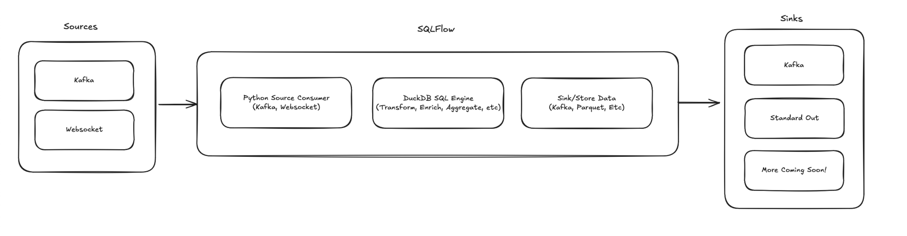
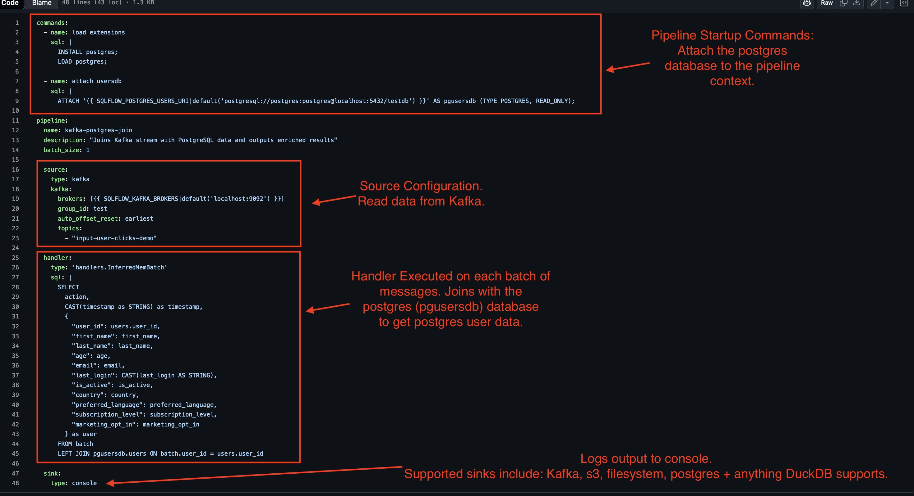

# Basics

SQLFlow is a high-performance stream processing engine that simplifies building data pipelines. SQLFlow pipelines are built using SQL. Think of SQLFLow as a lightweight, modern Flink. SQLFLow embeds [DuckDB](https://duckdb.org/) and [Apache Arrow](https://arrow.apache.org/) for high performance stream processing. SQLFlow can process 10's of thousands of events per second using only 100's of MiB of memory.

## Core Components

### Input Source

SQLFlow ingests data from a variety of input sources, including Kafka, and Webhooks. SQLFlow models the input as a stream of data.

### Handler

The handler specifies the SQL to execute. SQLFlow supports disk-based or in-memory handlers for tunable durability. SQLFlow uses DuckDB and Apache Arrow to execute SQL against the input source. Handlers contain the stream processing logica, filter, aggregate, enrich or drop data.

### Output Sink

SQLFlow writes the results of the SQL to output sources including: Kafka, Postgres, Filesystem, Blob Storage.

The following image shows an example SQLFlow configuration file:

The file explicitly contains a pipeline configuration with a source, handler and sink section. This configuration file also contains commands to be executed prior to the pipeline running. These commands support things like attaching databases to the pipeline execution context.

### SQLFlow Process

The SQLFlow process is a daemon that reads data from the input source, executes the SQL against the data and writes the output to the output sink. The SQLFlow process continuously runs until stopped. SQLFlow ships with logging and metrics to make the process easy to monitor.