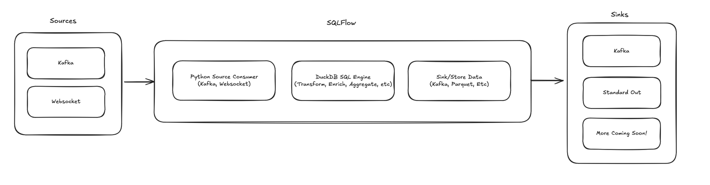
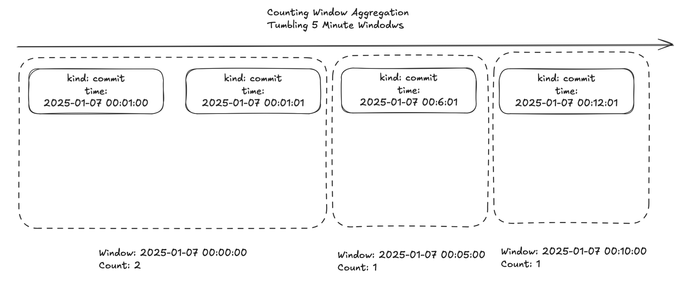
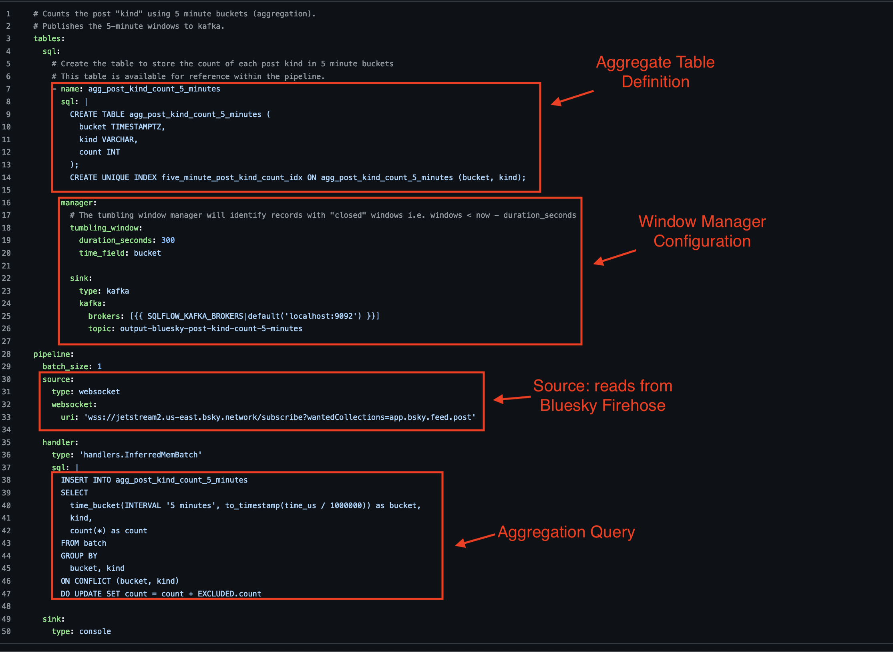
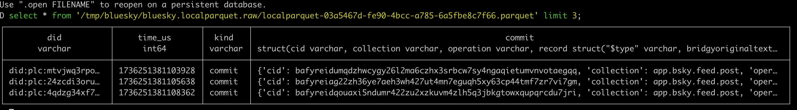

# Learning SQLFlow Using the Bluesky Firehose

SQLFlow is a new stream processing engine powered by DuckDB. SQLFlow brings DuckDB to streaming data, using a lightweight python-powered service. This means that end-users can run stateful stream processors and configure them using SQL, tapping into the entire DuckDB ecocystem. SQLFlow currently supports kafka and websockets as datasources. The websocket support makes it trivial to execute SQL against the Bluesky Social firehose:


This post shows how to leverage SQLFlow to process the Bluesky Firehose. 

----
All examples are available in the turbolytics/sql-flow github repo:

https://github.com/turbolytics/sql-flow/tree/v0.4.2/dev/config/examples/bluesky 
----

## Background

SQLFlow is a stateful stream processing service that embeds DuckDB for stream processing. SQLFlow is invoked using a configuration file and runs indefinitely against a stream of data, continuously executing the SQL. SQLFlow has a couple of components, shown in the following image:



These components include:

- **Source**: The originating data stream such as kafka or webhooks.
- **Handler**: The SQL to execute against the stream.
- **Sink**: The output location of the SQL results.

SQLflow is run as a continuous process that ingests the stream until stopped. 

----

The rest of the post focuses on concrete examples of how to configure and execute SQLFlow to interact with the Bluesky Firehose.

https://sql-flow.com/docs/tutorials/intro#getting-started

## Example: Save the Bluesky Firehose Directly to Kafka

This example writes the entire raw bluesky stream directly to kafka ([configuration file](https://github.com/turbolytics/sql-flow/blob/main/dev/config/examples/bluesky/bluesky.kafka.raw.yml)).

Start a kafka consumer of the output topic: 

```
docker exec -it kafka1 kafka-console-consumer --bootstrap-server=kafka1:9092 --topic=output-bluesky-firehose
```

Start the SQLFlow pipeline, in docker, using the bluesky raw consumer configuration file file:

```bash
docker run -e SQLFLOW_KAFKA_BROKERS=host.docker.internal:29092 -v $(PWD)/dev/config/examples:/examples turbolytics/sql-flow:latest run /examples/bluesky/bluesky.kafka.raw.yml
```

The kafka-console-consumer should show a stream of blueksy messages like the following:

```bash
...
{"did": "did:plc:xcs64vt2bhmnd74bihtyy3ft", "time_us": 1736214396394786, "kind": "commit", "commit": {"cid": "bafyreihpm3eghvjvfxv7kgbhyw6iiwnpsjog4r5jjl56snpuarba4et44i", "collection": "app.bsky.feed.post", "operation": "create", "record": {"$type": "app.bsky.feed.post", "createdAt": "2025-01-07T01:46:35.991Z", "langs": ["en"], "text": "i was gonna stream a little today but instead i am trying to work up the courage to respond to this email and set up my first ever therapy appointment lmao"}, "rev": "3lf4jp7jllw24", "rkey": "3lf4jp7bfzk27"}}
{"did": "did:plc:jg2t3ekvpxgyclhvu6mlftlt", "time_us": 1736214396397012, "kind": "commit", "commit": {"cid": "bafyreigmbe25zr4ptoeju7452rxmdje2ato5m3pa6doxc2jcxhvpbbbyre", "collection": "app.bsky.feed.post", "operation": "create", "record": {"$type": "app.bsky.feed.post", "createdAt": "2025-01-07T01:46:35.196Z", "embed": {"$type": "app.bsky.embed.record", "record": {"cid": "bafyreiecnporx5ndug4hofr7ouziljfiw3knh7krqsft4n4347nh7wmnpa", "uri": "at://did:plc:6ye4glvokfkr7m7vmvhdofwk/app.bsky.feed.post/3lf3wufkac22u"}}, "langs": ["pt"], "text": "Ai Luizinho \ud83e\udee6"}, "rev": "3lf4jp7i7lc2n", "rkey": "3lf4jp6j6n22q"}}
...
```

This is the raw Bluesky Firehose stream!

## Example: Transform Stream and Write to Stdout

This example performs a lightweight stream transform and writes the results to standard out ([configuration file](https://github.com/turbolytics/sql-flow/blob/main/dev/config/examples/bluesky/bluesky.kafka.transformed.yml)). The transformation extracts the timestamp and the post "kind" from the raw post, using the following sql:

```sql
SELECT
    to_timestamp(time_us / 1000000) as time,
    kind
FROM batch
```

Start the SQLFlow pipeline using the configuration file:

```
docker run -v $(PWD)/dev/config/examples:/examples turbolytics/sql-flow:latest run /examples/bluesky/bluesky.kafka.transformed.yml
```

SQLFlow should output something similar to the following: 

```
...
{"time": 1736248543704, "kind": "commit"}
{"time": 1736248543708, "kind": "commit"}
{"time": 1736248543897, "kind": "commit"}
{"time": 1736248543986, "kind": "commit"}
{"time": 1736248543994, "kind": "commit"}
{"time": 1736248543997, "kind": "commit"}
{"time": 1736248544001, "kind": "commit"}
{"time": 1736248544001, "kind": "commit"}
{"time": 1736248544086, "kind": "commit"}
{"time": 1736248544089, "kind": "commit"}
...
```

SQLFlow enabled running SQL transformations, using DuckDB, directly against the Bluesky Fireshose stream!

## Example: Aggregate the Stream Into 5 Minute Buckets and Write to Kafka

This example shows how to use SQLFlow to perform a tumbling window aggregation over the Bluesky Fireshose.

A tumbling window aggregation breaks a stream of events into fixed time blocks, called "windows", such as a 5-minute bucket. An aggregation is performed across all data points in a window, such as a max, average, total or count. Once the window ends, it’s done, and the next window starts fresh. Windows trade precision for decreased storage space, instead of storing every datapoint, a window will store a single datapoint per dimensions in the window.

The following image illustrates how 5 minute tumbling windows are applied to a stream of 4 events: 



Each each window counts the total number of events that occur within the 5 minute window. The first window contains 2 events. The next 2 windows each contain a single event. The benefit of tumbling windows comes when dealing large amounts of data. Imagine a clickstream with thousands of events per second. A 5 minute tumbling window aggregation could reduce the data to a handful of events per 5 minutes!!!

Tumbling windows in SQLFlow require a couple of different parts:

- **Aggregate table definition**: This is where the aggregated data is placed (such as a COUNT(*) over a 5 minute window.
- **Aggregation Query**: This is the query that is executed over the input stream to produce the aggregated results.
- **Window Manager**: The window manager includes the tumbling window duration and where to output closed windows. 

The pipeline configuration file is located here: 

https://github.com/turbolytics/sql-flow/blob/v0.4.2/dev/config/examples/bluesky/bluesky.kafka.windowed.yml



The results of executing this pipeline will be a series of events published to kafka, every 5 minutes.

**Step 1: Start kafka consumer:**

```
docker exec -it kafka1 kafka-console-consumer --bootstrap-server=kafka1:9092 --topic=output-bluesky-post-kind-count-5-minutes
```

**Step 2: Start SQLFlow tumbling window pipeline:**

```
docker run -e SQLFLOW_KAFKA_BROKERS=host.docker.internal:29092 -v $(PWD)/dev/config/examples:/examples turbolytics/sql-flow:latest run /examples/bluesky/bluesky.kafka.windowed.yml
```

**Step 3: Verify the output:**

After 5 minutes, the following output should show up in the kafka console consumer:

```
{"bucket": 1736250600000, "kind": "commit", "count": 10676}
{"bucket": 1736250600000, "kind": "identity", "count": 187}
{"bucket": 1736250600000, "kind": "account", "count": 237}
```

The bucket time emitted is the start of the tumbling window (in this case Tuesday, January 7, 2025 11:50:00 AM). This example reduced 11,100 bluesky events (10676 + 187 + 237) to just 3 events for the 5 minute window!

## Example: Save Bluesky Stream as Parquet

This final example shows how to use SQLFlow to store the bluesky firehose in a parquet locally ([configuration file](https://github.com/turbolytics/sql-flow/blob/v0.4.2/dev/config/examples/bluesky/bluesky.localparquet.raw.yml)). Parquet is a read-optimized storage format that is both compact and quick to read. SQLFlow uses DuckDB's native parquet write for export.

**Step 1: Create an output directory locally to store parquet files:**
    
```
mkdir -p /tmp/bluesky/bluesky.localparquet.raw
```

**Step 2: Start the SQLFlow pipeline:**

```
docker run -v /tmp/bluesky/bluesky.localparquet.raw:/tmp/bluesky/bluesky.localparquet.raw -v $(pwd)/dev/config/e
xamples:/examples turbolytics/sql-flow:latest run /examples/bluesky/bluesky.localparquet.raw.yml
```

**Step 3: Verify the output:**

Wait a minute, since the batch size is 1000. After 1000 messages have been processed a parquet file should show up in the tmp directory:

```
ls /tmp/bluesky/bluesky.localparquet.raw
localparquet-9c1069de-08c8-468d-9fed-d5e305237191.parquet
```

Use DuckDB to query the parquet file, for offline analysis:



## Conclusion

SQLFlow development is just getting started! SQLFlow aims to simplify stream processing in the same way that DuckDB is simplifying analytics. We have some exciting features lined up, including an Iceberg sink for writing data to Iceberg tables like Amazon Web Services (AWS) Iceberg S3 Tables! SQLFlow provides a lightweight way to persist streaming data. After SQLFlow persists the streaming data, traditional analytics tools like DuckDB, Snowflake, Databricks, or MotherDuck can run analytics on the data.

Thank you for reading, and if you would like to follow the project SQLFlow is available under an MIT license on GitHub !

https://github.com/turbolytics/sql-flow 


