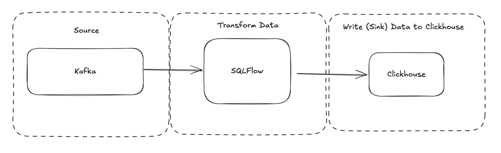
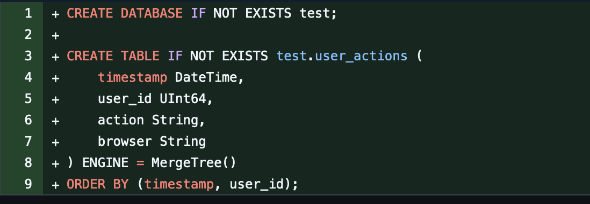
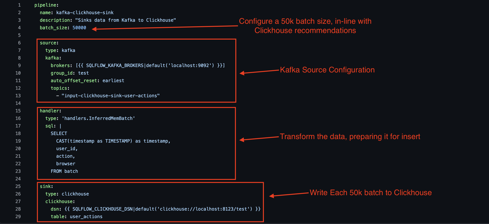

# Stream 70k Rows per second to Clickhouse using SQLFlow

This tutorial demonstrates how to stream messages from Kafka To Clickhouse using SQLFlow.

SQLFlow is a modern, cloud-native stream processing framework. It is designed to be simple, scalable, and performant. SQLFlow is well suited for streaming data from Kafka to Clickhouse. This tutorail demonstrates how to stream messages from Kafka to Clickhouse using SQLFlow.

## Pre-requisites

This tutorial uses SQLFlow to read data from Kafka, and write output to kafka:



A couple of per-requisites are required to start:

**Install SQLFlow**

- Clone the turbolytics/sql-flow repo: this contains the example pipeline configuration files and docker compose setup for this tutorial
- Pull the turbolytics docker image: The image is necessary to execute the SQLFlow pipeline.

**Start Kafka and Clickhouse**

SQLFlow includes a docker compose file with both kafka and clickhouse configured. Start it using the following command:

```
cd /path/to/sql-flow
docker-compose -f dev/kafka-single.yml up -d
```

Docker-compose will start a Clickhouse instance with the following table already configured ([source](https://github.com/turbolytics/sql-flow/blob/7c66aa2103ac69a50786c022b2780afcde7c74e2/dev/clickhouse/initdb.sql))



Connect to the clickhouse instance using the following command:

```
docker exec -it clickhouse clickhouse-client
ClickHouse client version 25.1.4.53 (official build).
Connecting to localhost:9000 as user default.
Connected to ClickHouse server version 25.1.4.

ch-1S_1K :) select count(*) from test.user_actions;

SELECT count(*)
FROM test.user_actions

Query id: c6fe1022-ff20-4a8a-9f5e-547f6aa5d99d

   ┌─count()─┐
1. │       0 │
   └─────────┘

1 row in set. Elapsed: 0.014 sec.
```

## Define the Pipeline

The following image shows the configuration file required to run the pipeline ([source](https://github.com/turbolytics/sql-flow/blob/7c66aa2103ac69a50786c022b2780afcde7c74e2/dev/config/examples/kafka.clickhouse.yml)):



## Run the Pipeline

**Publish test messages to Kafka**

```
python3 cmd/publish-test-data.py --num-messages=1000000 --topic="input-clickhouse-sink-user-actions" --fixture=user_action
```

This command publishes 1MM messages to the Kafka input topic.

**Start SQLFlow**

This command executes SQLFlow. SQLFlow will read messages from the Kafka topic, and write them to Clickhouse in batches of 50k.

```
python3 cmd/sql-flow.py run $(pwd)/dev/config/examples/kafka.clickhouse.yml --max-msgs-to-process=1000000

...
2025-02-15 15:36:49,462 [INFO] 69749.0: reqs / second
2025-02-15 15:36:49,519 [INFO] max messages reached
2025-02-15 15:36:49,528 [INFO] consumer loop ending: total messages / sec = 69432.0
```

Notice the output. On a 2 year old M1 Macbook Pro, SQLFlow is able to process ~70k messages per second!

**Verify the data in Clickhouse**

```
ch-1S_1K :) select count(*) from test.user_actions;

SELECT count(*)
FROM test.user_actions

Query id: fa4ab0bc-8ec0-4845-bdcd-8cb87c485d31

   ┌─count()─┐
1. │ 1000000 │
   └─────────┘

1 row in set. Elapsed: 0.012 sec.
```

# Conclusion

This tutorial demonstrated how to stream messages from Kafka to Clickhouse using SQLFlow. SQLFlow is a modern, cloud-native stream processing framework. It is designed to be simple, scalable, and performant. SQLFlow is well suited for streaming data from Kafka to Clickhouse.

https://clickhouse.com/