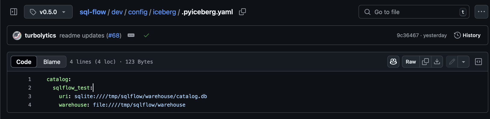
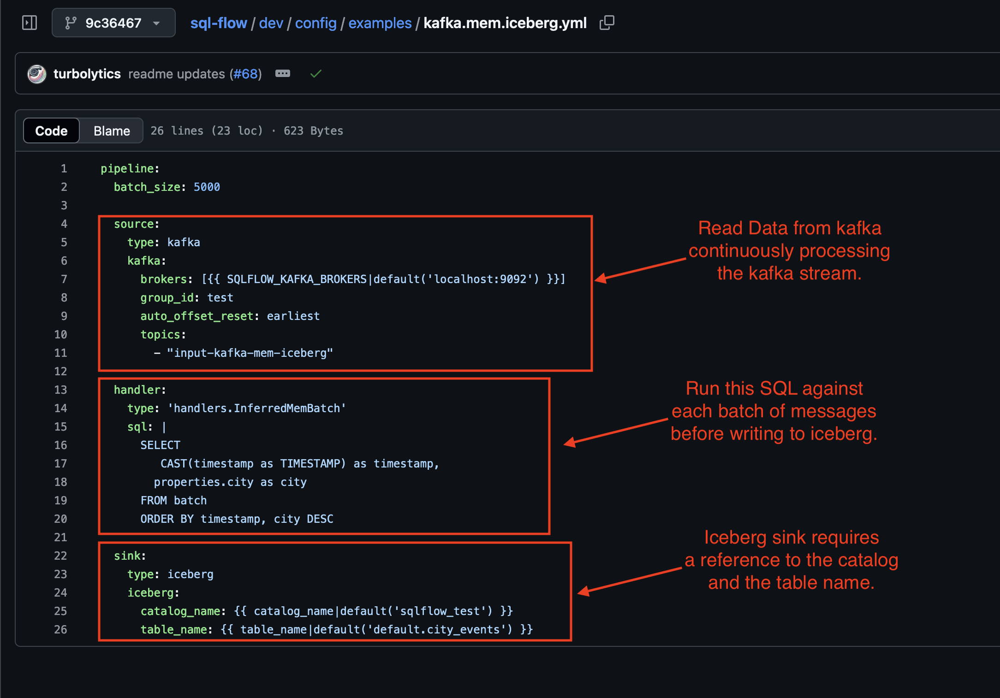
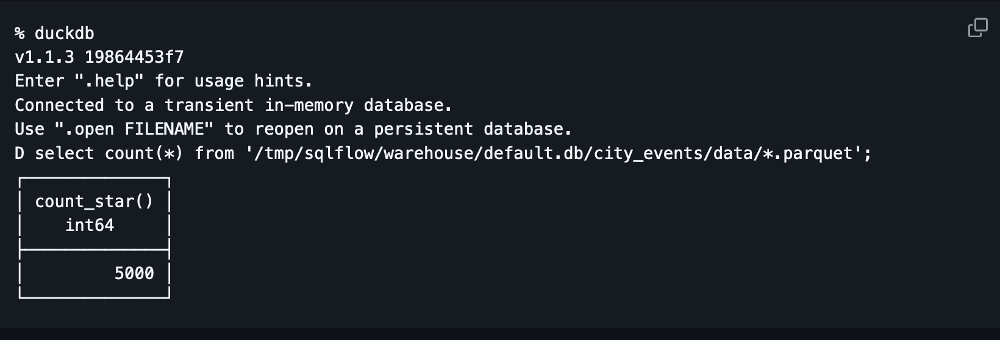

# Streaming to Iceberg using SQLFlow

This blog post will show how SQLFlow can stream data into Iceberg. Iceberg is an emerging standard that is gaining traction for use in storing large amounts of data on immutable storage (such as s3). The current iceberg ecosystem is heavy-weight, based on the JVM. The goal of this post is to show how simple it is to stream data from Kafka to Iceberg tables using SQLFlow!

## Iceberg Open File Format

[Apache Iceberg](https://iceberg.apache.org/) is an emerging file format to support writing and interacting with large scale analytic workloads. It standardizes on many common big data best practices such as schema evolution, partition management and compaction. Iceberg also allows for achieving ACID semantics on immutable storage systems like Amazon s3.

Iceberg generally requires complex cost intensive deployments, which limits its use to big data applications. SQLFlow addresses this by providing a simple SQL interface to write to Iceberg, backed by a lightweight python runtime that achieves 10's of thousands of messages per second processing throughput.

The most mature tools for interacting with iceberg right now are Apache spark, hive and the JVM. These tools have a steep learning curve, often require large multi-node deployments and are expensive to run. SQLFlow embeds iceberg support in a small, modern cloud-native python service.

Iceberg is still a very young project. This can be seen in the ecosystem, with projects like DuckDB iceberg extension still lacking iceberg write support! 


As mentioned, the java iceberg ecosystem is well developed. In addition, python is picking up tracking with the pyiceberg library.

Many cloud data vendors, such as Databricks, Dremio, Amazon Web Services (AWS) , Starburst , Cloudera , Snowflake , Google Cloud and others, have support for iceberg tables within their products. SQLFlow and pyiceberg provide a low cost modern path to getting data into these cloud providers. 

## Background: SQLFlow and Iceberg

Apache Pyiceberg provides a well-supported iceberg library written in python. Since SQLFlow is written using python, it was natural to leverage pyiceberg for writing to iceberg tables. A couple of components are required for this tutorial, to enable iceberg writing in SQLFlow ([source](https://github.com/turbolytics/sql-flow/pull/63/files)):

**Local Iceberg Catalog and Table**

The iceberg catalog is a place to house metadata for iceberg table. An iceberg catalog contains iceberg tables. Iceberg tables have both metadata and the underlying data. SQLFlow ships with a command to provision a catalog and table locally for testing ([command link](https://github.com/turbolytics/sql-flow/blob/v0.5.0/cmd/setup-iceberg-local.py)).

**Pyiceberg Configuration File**

SQLFlow directly leverages pyiceberg configuration. SQLFlow ships with a pyiceberg configuration file to make it easy to get started ([config file link](https://github.com/turbolytics/sql-flow/blob/v0.5.0/dev/config/iceberg/.pyiceberg.yaml)):



This configuration file specifies the catalog and warehouse to use for writes. 

**SQLFlow Pipeline Configuration File**

The final component is a SQLFlow pipeline configuration definition ([config file](https://github.com/turbolytics/sql-flow/blob/v0.5.0/dev/config/examples/kafka.mem.iceberg.yml)): 



This is the input into SQLFlow. This example configuration file reads from a kafka topic and writes to iceberg.

To recap, the components required to stream data into Iceberg, using SQLFlow are:

- A Local Iceberg SQLite catalog and table. 
- A Pyiceberg configuration file configured to reference the catalog and table.
- A SQLFlow pipeline configuration file for reading from kafka and writing to iceberg.

## Running the Pipeline 

This section walks through streaming data from kafka to iceberg using SQLFlow.

**Step 1: Install Prerequisites**

https://sql-flow.com/docs/tutorials/intro#getting-started

**Step 2: Initialize the SQLite iceberg catalog and test table:**

```bash
python3 cmd/setup-iceberg-local.py setup
created default.city_events
created default.bluesky_post_events
Catalog setup complete.
```

**Step 3: Start Kafka Locally**

```bash
docker-compose -f dev/kafka-single.yml up -d
```

**Step 4: Publish Test Messages to Kafka:**

```
python3 cmd/publish-test-data.py --num-messages=5000 --topic="input-kafka-mem-iceberg"
```

**Step 5: Run SQLFlow, which will read from kafka and write to the iceberg table locally:**

```bash
docker run \
  -e SQLFLOW_KAFKA_BROKERS=host.docker.internal:29092 \
  -e PYICEBERG_HOME=/tmp/iceberg/ 
  -v $(pwd)/dev/config/iceberg/.pyiceberg.yaml:/tmp/iceberg/.pyiceberg.yaml \
  -v /tmp/sqlflow/warehouse:/tmp/sqlflow/warehouse 
  -v $(pwd)/dev/config/examples:/examples 
  turbolytics/sql-flow:latest run /examples/kafka.mem.iceberg.yml
```

**Step 5: Verify iceberg data was written by querying it with duckdb:**



SQLFlow read data from kafka, applied the SQL over the messages and then wrote the data to iceberg! 

---- 

https://github.com/turbolytics/sql-flow 


