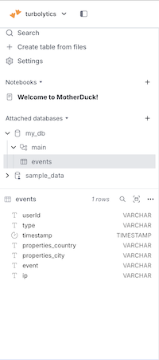
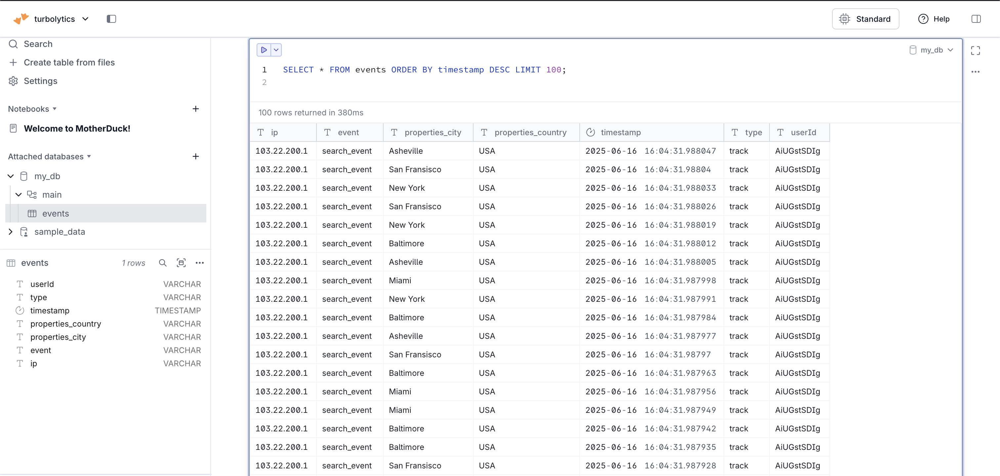

# Integrating SQLFlow with MotherDuck

This guide shows how to use SQLFlow to stream data from Kafka directly into a MotherDuck database using DuckDB's `ATTACH` integration.

---

### 📦 Prerequisites

#### 1. **MotherDuck Account**

Sign up at [https://motherduck.com](https://motherduck.com).

#### 2. **Create an App Token**

In your MotherDuck dashboard, generate a **MotherDuck App Token**.

#### 3. **Set Environment Variable**

Export the token so DuckDB can connect to your MotherDuck workspace:

```bash
export MOTHERDUCK_TOKEN=your_token_here
```

---

### 🧱 Prerequisites: Create Table in MotherDuck

Before running the pipeline, you’ll need to create the destination table in your MotherDuck database. You can do this using the DuckDB CLI:

```bash
% duckdb 'md:my_db'
```

Then run the following SQL to define the table schema:

```sql
CREATE TABLE events (
    ip TEXT,
    event TEXT,
    properties_city TEXT,
    properties_country TEXT,
    timestamp TIMESTAMP,
    type TEXT,
    userId TEXT
);
```



This matches the structure expected by the handler SQL in your pipeline.

---

### ⚙️ Example SQLFlow Config

Below is a working example of a SQLFlow pipeline that reads from a Kafka topic and inserts data into MotherDuck:

```yaml
commands:
  - name: attach to motherduck
    sql: |
      ATTACH 'md:my_db'

pipeline:
  name: kafka-motherduck-sink
  description: "Sinks data from kafka to motherduck"
  batch_size: {{ SQLFLOW_BATCH_SIZE|default(1000) }}

  source:
    type: kafka
    kafka:
      brokers: [{{ SQLFLOW_KAFKA_BROKERS|default('localhost:9092') }}]
      group_id: motherduck-sink-1
      auto_offset_reset: earliest
      topics:
        - "input-user-clicks-motherduck"

  handler:
    type: 'handlers.InferredMemBatch'
    sql: |
      INSERT INTO my_db.events
      SELECT
        ip,
        event,
        properties ->> 'city' AS properties_city,
        properties ->> 'country' AS properties_country,
        CAST(timestamp AS TIMESTAMP) AS timestamp,
        type,
        userId
      FROM batch;

  sink:
    type: noop
```

---

### 🚀 Running the Pipeline

With everything configured, start the SQLFlow pipeline:

```bash
python3 cmd/sql-flow.py run --metrics=prometheus dev/config/examples/kafka.motherduck.yml
```

---

### 💥 Generating Test Traffic

To populate Kafka with test data, run:

```bash
python3 cmd/publish-test-data.py --num-messages=1000000 --topic="input-user-clicks-motherduck"
```

This sends one million mock user interaction events into Kafka for SQLFlow to ingest.

---

### 📊 Verifying in MotherDuck

1. Open your [MotherDuck dashboard](https://app.motherduck.com).
2. Navigate to `my_db`.
3. Run:

   ```sql
   SELECT * FROM events ORDER BY timestamp DESC LIMIT 100;
   ```

You should see the flattened and streamed records from Kafka!

