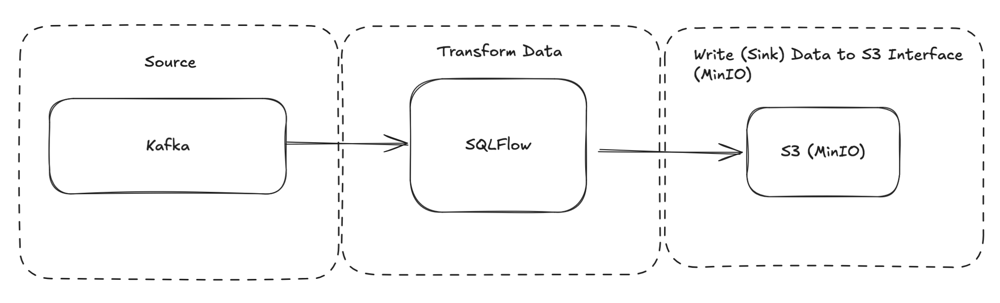
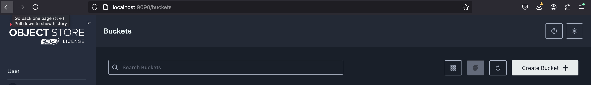
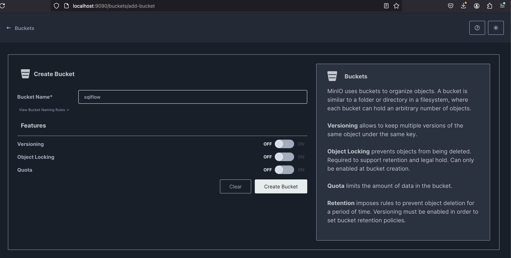
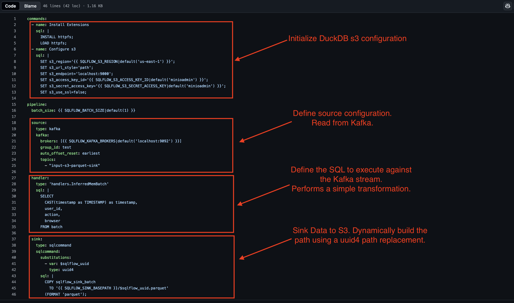
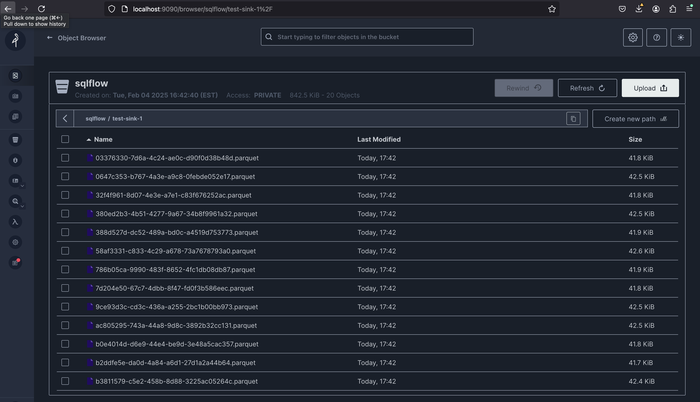

# Stream Data from Kafka to S3 in Parquet Format using SQLFlow

In modern data architectures, efficiently moving streaming data from Kafka to S3 in a structured format like Parquet is crucial for analytics, machine learning, and long-term storage. SQLFlow simplifies this process by enabling declarative SQL-based stream processing, making it easy to transform and persist Kafka data to cloud storage.

In this tutorial, you'll learn how to:

- Ingest data from a Kafka topic using SQLFlow.
- Transform and batch streaming data with SQL queries.
- Write the processed data to an S3-compatible storage in Parquet format for efficient storage and querying.

By the end, you'll have a fully functional pipeline that continuously streams Kafka events, processes them using SQL, and stores them in Parquet files on S3.



This tutorial uses a MinIO instance running locally in docker-compose. MinIO is a drop in replacement for s3. We use it to simplify reproducibility and development of the s3 sink. The same configuration can be used with AWS S3.

## Prerequisites

This tutorial will run a SQLFlow pipeline to read data from Kafka, transform the data using SQL queries, and write the processed data to S3 in Parquet format. Setup instructions are provided below:

[Quick Start with SQLFlow](./intro.md)

This provides the necessary setup to run SQLFlow pipelines, including the Docker image, Kafka, and SQLFlow configuration files.

This tutorial requires the extra step to create a bucket within MinIO to store the parquet files. 

Setup MinIO:

- Navigate to localhost:9090 in your browser, and select "Create Bucket"



- Create a bucket named `sqlflow`



You now have everything necessary to run a SQLFlow pipeline that reads data from Kafka, processes it using SQL queries, and writes the processed data to S3 in Parquet format!

## Define the Pipeline

### Pipeline Configuration Overview

The pipeline consists of the following key components:

**Input Source:**

- Data is ingested from a Kafka topic called input-s3-parquet-sink.
- The input format is JSON, allowing for structured message processing.

**Transformation:**

- SQLFlow executes a SQL query against each batch of input messages.
- The query selects a couple fields and provides a timestamp type cast.

**Output Sink:**

- The transformed data is written to an S3-compatible storage in Parquet format. 

### Configuration File

The following image shows the configuration file required to run the pipeline (source):



This configuration file is the input into SQLFlow. It reads from Kafka, batches messages using DuckDB and then sinks the data to an S3 compatible store (in this case MinIO). Next, you’ll deploy and run the pipeline to see it in action!

## Run the Pipeline

**Step 1: Publish Test Data to Kafka**

Execute the test command, included with SQLFlow, to publish messages to the input topic:
```
python3 cmd/publish-test-data.py --num-messages=100000 --topic="input-s3-parquet-sink" --fixture=user_action

2025-02-04 17:38:03,024 [INFO] published 0 of 100000
2025-02-04 17:38:03,095 [INFO] published 10000 of 100000
2025-02-04 17:38:03,136 [INFO] published 20000 of 100000
2025-02-04 17:38:03,176 [INFO] published 30000 of 100000
2025-02-04 17:38:03,216 [INFO] published 40000 of 100000
2025-02-04 17:38:03,256 [INFO] published 50000 of 100000
2025-02-04 17:38:03,297 [INFO] published 60000 of 100000
2025-02-04 17:38:03,337 [INFO] published 70000 of 100000
2025-02-04 17:38:03,379 [INFO] published 80000 of 100000
2025-02-04 17:38:03,419 [INFO] published 90000 of 100000
2025-02-04 17:38:03,469 [INFO] published 100000 of 100000
```

**Step 2: Start SQLFlow**

Start SQLFlow inside a Docker container, using the configuration file:
```
docker run \
    -v $(pwd)/dev/config/examples:/examples \
    -e SQLFLOW_S3_ENDPOINT=host.docker.internal:9000 \
    -e SQLFLOW_KAFKA_BROKERS=host.docker.internal:29092 \
    -e SQLFLOW_BATCH_SIZE=5000 \
    -e SQLFLOW_SINK_BASEPATH=s3://sqlflow/test-sink-1 \
    turbolytics/sql-flow:7d82de9 run /examples/s3.parquet.sink.yml --max-msgs-to-process=100000
```

**Step 3: Verify Parquet Data in MinIO (S3)**

Next, navigate back to the MinIO console. It should show the files written to the `sqlflow` bucket in Parquet format:



**Step 4: Query S3 Data using DuckDB**

```
duckdb
D INSTALL httpfs;
D LOAD httpfs;
D SET s3_use_ssl=false;
D SET s3_secret_access_key='minioadmin';
D SET s3_access_key_id='minioadmin';
D SET s3_endpoint='localhost:9000';
D SELECT COUNT(*) FROM read_parquet('s3://sqlflow/test-sink-1/*.parquet');
┌──────────────┐
│ count_star() │
│    int64     │
├──────────────┤
│       100000 │
└──────────────┘
```

## Advanced Configuration

Choosing an appropriate batch size is important for optimal parquet file size and query performance. The batch size determines how many messages are processed in each batch before writing to S3. 


## Conclusion

By combining the power of Kafka, SQLFlow, and MinIO, this pipeline efficiently streams, transforms, and stores data in Parquet format, enabling real-time and batch processing with minimal configuration. Using SQLFlow’s declarative SQL approach, complex streaming transformations become straightforward, while DuckDB ensures efficient in-memory batch processing. Finally, leveraging S3-compatible storage like MinIO provides scalable, cost-effective, and query-friendly long-term storage.

With this setup, you’ve built a robust, end-to-end data pipeline that can handle real-time data ingestion, processing, and storage, ready to support advanced analytics, machine learning workflows, or big data applications.


